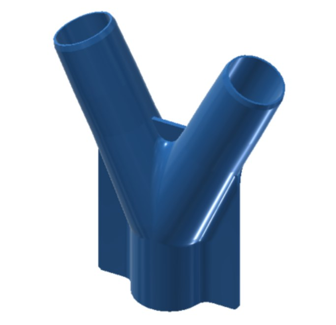
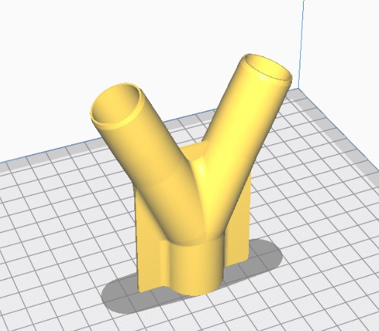
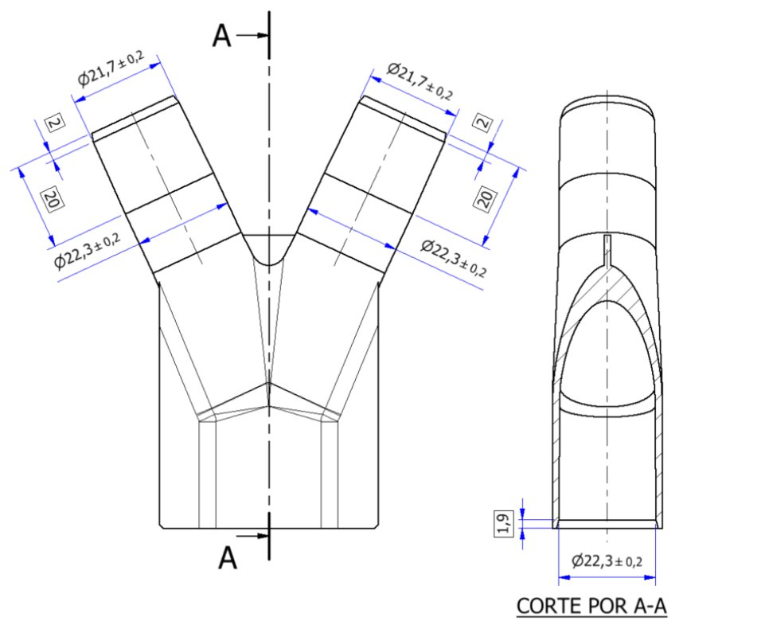

# Manual de impresión de peza “Conexión-Y 1.1”

## Descripción da peza.

  

A peza é unha conexión en “Y” bifurcando saídas ou entradas de aire, conectado a un tubo de respirador ou filtro quirúrxico.
 
 
## Recomendacións de impresión:
* Material recomendado: PLA/PETG.
* Posición impresión en vertical

  

* Brim para adhesión a base
* No Infill (Recheo 0)
* Usar 2 capas exteriores e 2 interiores (en caso de nozzle de 0.4mm)
* Altura capa 0.2 como máximo ou altura variable si o permite o slicer
* Non é necesario o uso de soportes.

IMPRESCINDIBLE: IMPRESORA CALIBRADA
Pode usarse un pé de rei para comprobar as medidas exteriores das saídas e o diámetro interior da entrada, imprescindible para o correcto acoplamento nos respiradores, tubos e filtros.

## Postprocesado / Control final
* Eliminar rebabas
* Comprobar que non hai ocos entre capas que poidan comprometer a estanqueidade
* Comprobar medidas e tolerancias:

  

Diámetros tras o primeiro chaflán

		
NOTA: É preferible primar calidade en lugar de velocidade ou cantidade de pezas.

